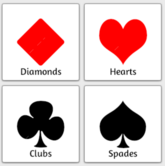
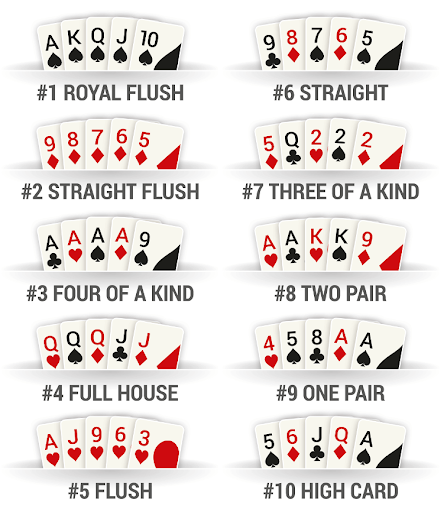
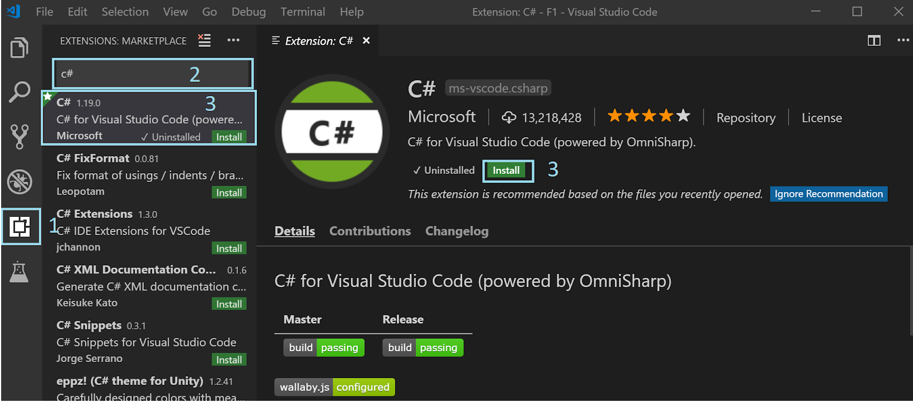

# Functional Programming C# Workshop
 

## Goals

- Score poker game
- Imperative programming
- Functional programming

## Anatomy Card

### Card Suits


### Card Values
- 2-10​
- Jack(11)​
- Queen(12)​
- King(13)​
- Ace(14)

### Hand Ranking


### Prerequisites
- VS Code (https://code.visualstudio.com/download)
- Net Core 2.2 (https://dotnet.microsoft.com/download)
- C# Extension



## 0. Create two projects
- PokerSolution
- - Poker.Library(Class library project)
- - - ```dotnet new classlib```
- - Poker.Test(Xunit project)
- - - ```dotnet new xunit```


## 1. Create unit test

Create CardTest.cs file in Poker.Test
```
[Fact]
public void CanDescribeCard()
{
    var card = new Card(Rank.Ace, Suit.Spades);

    Assert.Equal("Ace of Spades", card.ToString());
}
```

Add project reference to Poker.Test
Command:
```
dotnet add reference ../Poker.Library/Poker.Library.csproj
```
Add  the next files to Poker.Library
Suit.cs
```
public enum Suit
{
    Clubs,
    Diamonds,
    Hearts,
    Spades
    
}
```
 Rank.cs

```
public enum Rank
{
    Two = 2,
    Three,
    Four,
    Five,
    Six,
    Seven,
    Eight,
    Nine,
    Ten,
    Jack,
    Queen,
    King,
    Ace
}
```
Card.cs
```
public class Card
{
    public Rank Rank { get; set; }
    public Suit Suit { get; set; }

    public Card(Rank rank, Suit suit)
    {
        Rank = rank;
        Suit = suit;
    }
}
```
 

When this test passes, move on to the next exercise.


## 2. Hight Card
Add PokerTest.cs file to Poker.Test project and the next test:
```
[Fact]
public void HighCardTest_True()
{
    var pokerHand = new List<Card>(){
        new Card(Rank.Ace, Suit.Diamonds),
        new Card(Rank.Jack, Suit.Spades),
        new Card(Rank.Nine, Suit.Diamonds),
        new Card(Rank.Ten, Suit.Diamonds),
        new Card(Rank.Seven, Suit.Diamonds),
    };
    var poker = new Poker.Library.Poker();

    var highCard = poker.HighCard(pokerHand);

    Assert.Equal(Rank.Ace, highCard.Rank);
}
```

Add Poker.cs file to Poker.Library
```
public class Poker
{
}
``` 
When this test passes, move on to the next exercise.
(Tip: Try to sort the collection first)

## 3. ValueHand
Add the ValueHand enum to your project
```
public enum ValueHand
{
    HighCard,
    Pair,
    TwoPair,
    ThreeOfAKind,
    Straight,
    Flush,
    FullHouse,
    FourOfAKind,
    StraightFlush,
    RoyalFlush
}
```
And add the next test to your PokerTest file.
```
[Fact]
public void IsPairTest_True()
{
    var pokerHand = new List<Card>(){
        new Card(Rank.Ace, Suit.Diamonds),
        new Card(Rank.Ace, Suit.Spades),
        new Card(Rank.Nine, Suit.Diamonds),
        new Card(Rank.Ten, Suit.Diamonds),
        new Card(Rank.Seven, Suit.Diamonds),
    };
    var poker = new Poker.Library.Poker();

    Assert.True(poker.IsPair(pokerHand));
}

[Fact]
public void IsTwoPairTest_True()
{
    var pokerHand = new List<Card>(){
        new Card(Rank.Ace, Suit.Diamonds),
        new Card(Rank.Ace, Suit.Spades),
        new Card(Rank.Nine, Suit.Diamonds),
        new Card(Rank.Nine, Suit.Spades),
        new Card(Rank.Seven, Suit.Diamonds),
    };
    var poker = new Poker.Library.Poker();

    Assert.True(poker.IsTwoPair(pokerHand));
}

[Fact]
public void IsThreeOfAKindTest_True()
{
    var pokerHand = new List<Card>(){
        new Card(Rank.Ace, Suit.Diamonds),
        new Card(Rank.Ace, Suit.Spades),
        new Card(Rank.Ace, Suit.Clubs),
        new Card(Rank.Ten, Suit.Diamonds),
        new Card(Rank.Seven, Suit.Diamonds),
    };
    var poker = new Poker.Library.Poker();

    Assert.True(poker.IsThreeOfAKind(pokerHand));
}

 [Fact]
public void IsFullHouseTest_True()
{
    var pokerHand = new List<Card>(){
        new Card(Rank.Ace, Suit.Diamonds),
        new Card(Rank.Ace, Suit.Spades),
        new Card(Rank.Nine, Suit.Diamonds),
        new Card(Rank.Nine, Suit.Clubs),
        new Card(Rank.Nine, Suit.Spades),
    };
    var poker = new Poker.Library.Poker();

    Assert.True(poker.IsFullHouse(pokerHand));
}

[Fact]
public void IsFourOfAKindTest_True()
{
    var pokerHand = new List<Card>(){
        new Card(Rank.Ace, Suit.Diamonds),
        new Card(Rank.Nine, Suit.Hearts),
        new Card(Rank.Nine, Suit.Diamonds),
        new Card(Rank.Nine, Suit.Clubs),
        new Card(Rank.Nine, Suit.Spades),
    };
    var poker = new Poker.Library.Poker();

    Assert.True(poker.IsFourOfAKind(pokerHand));
}
```
When this test passes, move on to the next exercise.

## 4. Hand Rank answers
## 5. Refactor
Card class
Hand class

## 6. Sequences
Add the next test to PokerTest.cs.
```
[Fact]
public void IsFlushTest_True()
{
    var pokerHand = new List<Card>(){
        new Card(Rank.Ace, Suit.Diamonds),
        new Card(Rank.Two, Suit.Diamonds),
        new Card(Rank.Nine, Suit.Diamonds),
        new Card(Rank.Ten, Suit.Diamonds),
        new Card(Rank.Seven, Suit.Diamonds),
    };
    var poker = new Poker.Library.Poker();

    Assert.True(poker.IsFlush(pokerHand));
}

[Fact]
public void IsStraightTest_True()
{
    var pokerHand = new List<Card>(){
        new Card(Rank.Two, Suit.Diamonds),
        new Card(Rank.Three, Suit.Spades),
        new Card(Rank.Four, Suit.Diamonds),
        new Card(Rank.Five, Suit.Diamonds),
        new Card(Rank.Six, Suit.Diamonds),
    };
    var poker = new Poker.Library.Poker();

    Assert.True(poker.IsStraight(pokerHand));
}

[Fact]
public void IsStraightFlushTest_True()
{
    var pokerHand = new List<Card>(){
        new Card(Rank.Five, Suit.Diamonds),
        new Card(Rank.Six, Suit.Diamonds),
        new Card(Rank.Seven, Suit.Diamonds),
        new Card(Rank.Eight, Suit.Diamonds),
        new Card(Rank.Nine, Suit.Diamonds),
    };
    var poker = new Poker.Library.Poker();

    Assert.True(poker.IsStraightFlush(pokerHand));
}

[Fact]
public void IsRoyalFlushTest_True()
{
    var pokerHand = new List<Card>(){
        new Card(Rank.Ten, Suit.Diamonds),
        new Card(Rank.Jack, Suit.Diamonds),
        new Card(Rank.Queen, Suit.Diamonds),
        new Card(Rank.King, Suit.Diamonds),
        new Card(Rank.Ace, Suit.Diamonds),
    };
    var poker = new Poker.Library.Poker();

    Assert.True(poker.IsRoyalFlush(pokerHand));
}
```
When this tests pass, move on to the next exercise.

## 7. Answers
## 8. Refactor
## 9. Next steps
